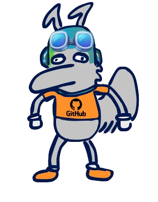
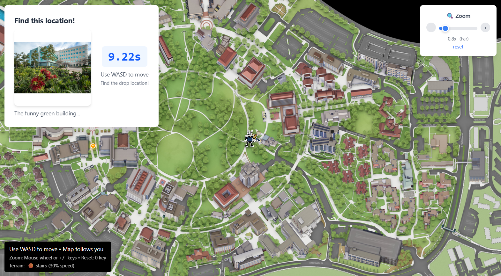

# PetrRun
25' Summer GitHub/UCI Hackathon

Welcome to **PetrRun**, a fast-paced, Zot-filled game built with UCI spirit during the 2025 Summer GitHub/UCI Hackathon!

> "It’s chaotic, it’s late-night, it’s UCI — and now, it’s a game."  

Meet Github Petr! (Drawn by one of our very own team members!)



## 🎮 What is PetrRun?

PetrRun is a speed running based off of GeoGuessr with a twist, a browser game inspired by UCI’s legendary Petr drops and Zot culture. Find the petr on the map, as fast as possible in the hilly terrain of UCI.

## 🔧 Built With

- React + Vite + React Router
- Tailwind CSS
- OJL, Threejs
- Anteater themed sticker art 🎨

## 🧠 Inspiration

We wanted to build something just for UCI students — something that captures the *fever dream energy* of college nights, meme culture, and our undying love for campus inside jokes.  

And of course… Zot Zot Zot 🐜💥

Thus we sought to emulate the ever-so-famous Petr drops that send UCI students into a craze for mere stickers. Tell any other person about the drops, and you'll be met with, "Seriously?" Petr stickers are a nod to our school mascot, Peter the Anteater, and the mixing pot of interests and cultures that are here are UCI. These Petr stickers are "dropped" by anonymous UCI students at a random location, revealed via a photo on Instagram, at preannounced(or not!) time somewhere on UCI's campus, where students will immediately bolt to *just* for a sticker.

This game simulates exactly that. The player chooses a location anywhere on UCI's campus, and with a countdown of "**3, 2, 1!**" the player will receive an image of some location on UCI's campus. The player will have to identify this location and move their character to that spot on the map to complete the game, just like in a real Petr drop! Players will have to determine the best possible path to the drop site, taking into consideration varying terrain, to get there the fastest and the best possible chance of getting stickers!

Here's a sneak peak at the game!



## 🔊 Features

- Smooth animations with moving Petr-stickers
- Background music that fades in for ~vibes~
- Competitive timing to race against your friends

## 🚀 Getting Started

Clone and run locally:

```bash
git clone https://github.com/your-username/PetrRun.git
cd PetrRun
npm install
npm run dev

✨ Contributions
This project was created for fun by UCI students. Feel free to fork and contribute, or just play around with it!

🤝 Credits
UCI & GitHub Summer Hackathon Team

Stickers & Art by the PetrRun Team

Game logic, Zot vibes, and code chaos by UCI students 💻

🐜 Zot Zot Zot


created new branch
